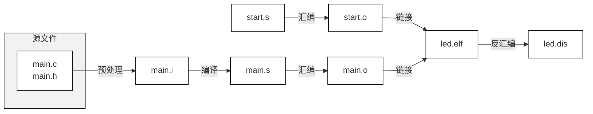

# 嵌入式Linux应用

## GCC编译器

### GCC编译过程



1. `-E`：预处理(preprocessing)，仅对源文件进行预处理（头文件展开和宏替换），如果未指定`-o`选项则结果输出到标准输出，生成`.i`文件

   - ```shell
     gcc -E main.c -o main.i
     ```

2. `-S`：对源文件或`.i`文件进行预处理、编译(compilation)，不进行汇编，如果未指定`-o`选项则结果保存到与`.c`文件同名的`.s`文件**(汇编码)**

   - ```shell
     gcc -S main.i -o main.s
     ```

3. `-c`：对源文件或`.s`文件进行预处理、编译和汇编(assembly)，不进行链接，对`.s`文件进行汇编，如果未指定`-o`选项则结果保存到与.c文件同名的`.o`文件**(机器码)**

   - ```shell
     gcc -c main.s -o main.o
     ```

4. `-O`：链接(linking)，生成可执行文件

   - ```shell
     gcc -O[1~3] main.o -o main
     ```

5. `-o`：对源文件进行预处理、编译和汇编、链接(linking)，生成可执行文件

   - ```shell
     gcc -o main main.c
     ```

6. `-std=standard`：指定语言标准版本

   - ```shell
     g++ -std=c++17 -o hello_world main.cpp hello.cpp
     ```

7. `-I <头文件目录>`：指定头文件目录

   - ```makefile
     gcc -Iinclude -c -o main.o main.c # 在当前目录下的include目录查找头文件
     ```

8. `-L <库文件目录>`：指定链接时库文件目录

9. `-l <库文件目录>`：指定链   接哪一个库文件

10. `-v`：显示编译过程

    - ```shell
      gcc -E main.c -o main.i -v
      ```

11. `-M`：打印依赖,生成`.d`文件

    - ```shell
      gcc -M main.c -o main.d
      gcc -c hello.c -o hello.o -MD -MF hello.d
      ```

12. 制作静态库

    - ```shell
      gcc -c -o main.o main.c
      gcc -c -o sub.o sub.c
      ar crs libsub.a sub.o # 链接成静态库
      gcc -o test main.o libsub.a
      ```

13. 制作动态库

    - ```shell
      gcc -c -o main.o main.c
      gcc -c -o sub.o sub.c
      gcc -shared -o libsub.so sub.o # 链接成动态库
      gcc -o test main.o libsub.so
      # 或者
      gcc -o test main.o -lsub -L <libsub.so所在目录> # libsub.so 省略前缀lib和后缀.so
      
      # 运行
      #① 先把 libsub.so 放到 Ubuntu 的/lib 目录，然后就可以运行 test 程序。
      #② 如果不想把 libsub.so 放到/lib，也可以放在某个目录比如/a，然后如下执行：
      #export LD_LIBRARY_PATH=$LD_LIBRARY_PATH:/a 
      ```

14. `-finput-charset=charset`表示源文件的编码方式, 默认以UTF-8来解析。`-fexec-charset=charset` 表示可执行程序里的字时候以什么编码方式来表示，默认是UTF-8。

    - ```shell
      gcc -finput-charset=GB2312 -fexec-charset=GB2312 -o main.c
      ```

15. 其它选项

    - ```shell
      gcc -E main.c # 查看预处理结果，比如头文件是哪个
      gcc -E -dM main.c > 1.txt # 把所有的宏展开，存在 1.txt 里
      gcc -Wp,-MD,abc.dep -c -o main.o main.c # 生成依赖文件 abc.dep，后面 Makefile 会用
      echo 'main(){}'| gcc -E -v - # 它会列出头文件目录、库目录(LIBRARY_PATH)
      ```

## Makefile

文件a.c

```C
#include <stdio.h>

int main()
{
	func_b();
	return 0;
}
```

文件b.c

```c
#include <stdio.h>

void func_b()
{
	printf("This is B\n");
}
```

编译：

```bash
gcc -o test a.c b.c
```

运行：

```bash
./test
```

结果：

```bash
This is B
```

**gcc -o test a.c b.c**  这条命令虽然简单，但是它完成的功能不简单。
它们要经过下面几个步骤：

* 1）对于**a.c**：执行：预处理 编译 汇编 的过程，**a.c ==>xxx.s ==>xxx.o** 文件。
* 2）对于**b.c**：执行：预处理 编译 汇编 的过程，**b.c ==>yyy.s ==>yyy.o** 文件。
* 3）最后：**xxx.o**和**yyy.o**链接在一起得到一个**test**应用程序。

提示：**gcc -o test a.c b.c -v** ：加上一个**‘-v’**选项可以看到它们的处理过程，

缺点：对所有的文件都会再处理一次，即使 **b.c** 没有经过修改，b.c 也会重新编译一次，当文件比较少时，这没有没有什么问题，当文件非常多的时候，就会带来非常多的效率问题如果文件非常多的时候，只是修改了一个文件，所用的文件就会重新处理一次，编译的时候就会等待很长时间。

对于这些源文件，应该分别处理，先分别编译它们（预处理、编译、汇编），最后再把它们链接在一次，比如：


```bash
# 编译
gcc -o a.o a.c
gcc -o b.o b.c
# 链接
gcc -o test a.o b.o
```

> 修改**a.c**之后，**a.c**会重新编译，然后再把它们链接在一起就可以了。**b.c**就不需要重新编译。

怎么知道哪些文件被更新了/被修改了？

比较时间：比较 **a.o** 和 **a.c** 的时间，如果**a.c**的时间比 **a.o** 的时间更加新的话，就表明 **a.c** 被修改了。同理，**b.o**和**b.c**也会进行同样的比较，比较**test**和 **a.o**，**b.o** 的时间，如果**a.o**或者**b.o**的时间比**test**更加新的话，就表明应该重新生成**test**。

Makefile就是这样做的。

Makefie最基本的语法是规则，规则：

```bash
目标 : 依赖1 依赖2 ...
[TAB]命令
```

当“依赖”比“目标”新，执行它们下面的命令。我们要把上面三个命令写成makefile规则，如下：

```bash
test ：a.o b.o  #test是目标，它依赖于a.o b.o文件，一旦a.o或者b.o比test新的时候，就需要执行下面的命令，重新生成test可执行程序。
gcc -o test a.o b.o
a.o : a.c  # a.o依赖于a.c，当a.c更加新的话，执行下面的命令来生成a.o
gcc -c -o a.o a.c
b.o : b.c  # b.o依赖于b.c,当b.c更加新的话，执行下面的命令，来生成b.o
gcc -c -o b.o b.c
```

执行make命令的时候，就会在当前目录下面找到名字为：Makefile的文件，根据里面的内容来执行里面的判断/命令。

### Makefile的语法

本节我们只是简单的讲解Makefile的语法，如果想比较深入

学习Makefile的话可以：

* a. 百度搜 "gnu make 于凤昌"。
* b. 查看官方文档: [http://www.gnu.org/software/make/manual/](http://www.gnu.org/software/make/manual/)

#### a. 通配符 - %

假如一个目标文件所依赖的依赖文件很多，那样岂不是我们要写很多规则，这显然是不合乎常理的

可以使用通配符，来解决这些问题。

对上节程序进行修改代码如下：

```bash
test: a.o b.o 
	gcc -o test $^
	
%.o : %.c
	gcc -c -o $@ $<
```

目标 : 依赖1 依赖2 ...

%.o：表示所用的.o文件

%.c：表示所有的.c文件

\$@：表示目标

\$\<：表示第1个依赖文件

\$\^：表示所有依赖文件

我们来在该目录下增加一个 c.c 文件，代码如下：

```bash
#include <stdio.h>

void func_c()
{
	printf("This is C\n");
}
```

然后在main函数中调用修改Makefile，修改后的代码如下：

```bash
test.exe:a.o b.o c.o
        gcc -O $^ -o $@
%.o:%.c
        gcc -c $< -o $@
```

执行： 

```bash
make
```

结果：

```bash
gcc -c -o a.o a.c
gcc -c -o b.o b.c
gcc -c -o c.o c.c
gcc -o test a.o b.o c.o
```

运行：

```bash
./test
```

结果：

```bash
This is B
This is C
```

#### b. 假想目标: .PHONY

我们想清除文件，我们在Makefile的结尾添加如下代码就可以了：

```bash
clean:
	rm *.o test
```

- 执行 make ：生成第一个可执行文件。
- 执行 make clean : 清除所有文件，即执行： rm \*.o test。

make后面可以带上目标名，也可以不带，如果不带目标名的话它就想生成第一个规则里面的第一个目标。

使用Makefile

执行：**make [目标]** 也可以不跟目标名，若**无目标默认第一个目标**。我们直接执行make的时候，会在makefile里面找到第一个目标然后执行下面的指令生成第一个目标。当我们执行 make clean 的时候，就会在 Makefile 里面找到 clean 这个目标，然后执行里面的命令，这个写法有些问题，原因是我们的目录里面没有 clean 这个文件，这个规则执行的条件成立，他就会执行下面的命令来删除文件。

如果：该目录下面有名为clean文件怎么办呢？

我们在该目录下创建一个名为 “clean” 的文件，然后重新执行：make然后make
clean，结果(会有下面的提示：)：

```bash
make: \`clean' is up to date.
```

它根本没有执行我们的删除操作，这是为什么呢？

我们之前说，一个规则能过执行的条件：

1. 目标文件不存在

2. 依赖文件比目标新

现在我们的目录里面有名为“clean”的文件，目标文件是有的，并且没有

依赖文件，没有办法判断依赖文件的时间。这种写法会导致：有同名的"clean"文件时，就没有办法执行make clean操作。解决办法：我们需要把目标定义为假象目标，用关键子PHONY

```makefile
.PHONY: clean //把clean定义为假象目标。他就不会判断名为“clean”的文件是否存在，
```

然后在Makfile结尾添加`.PHONY: clean`语句，重新执行：make clean，就会执行删除操作。

#### C. 变量

在makefile中有两种变量：

1. 简单变量（即时变量）：使用 `:=` 表示，它的值在定义的时候已经被确定了

   - ```makefile
     A := xxx	# A的值即刻确定，在定义时即确定
     ```

2. 延时变量：使用`=`表示。它只有在使用到的时候才确定，在定义/等于时并没有确定下来

   - ```makefile
     B = xxx  	# B的值使用到时才确定
     ```

3. 

想使用变量的时候使用“\$”来引用，如果不想看到命令是，可以在命令的前面加上`@`符号，就不会显示命令本身。

当我们执行make命令的时候，make这个指令本身，会把整个Makefile读进去，进行全部分析，然后解析里面的变量。常用的变量的定义如下：

```bash
:= 	# 即时变量 A的值即刻确定，在定义时即确定
= 	# 延时变量 B的值使用到时才确定
?= 	# 延时变量, 如果是第1次定义才起效, 如果在前面该变量已定义则忽略这句
+= 	# 附加, 它是即时变量还是延时变量取决于前面的定义
?=: # 如果这个变量在前面已经被定义了，这句话就会不会起效果，
```

实例：

```bash
A := $(C)
B = $(C)
C = abc

#D = 100ask
D ?= weidongshan
# 加@不会显示命令本身
all:
	@echo A = $(A)
	@echo B = $(B)
	@echo D = $(D)

C += 123
```

执行：

```bash
make
```

结果：

```bash
A =
B = abc 123
D = weidongshan
```

分析：

1) A := \$(C)：

A为即使变量，在定义时即确定，由于刚开始C的值为空，所以A的值也为空。

2) B = \$(C)：
   B为延时变量，只有使用到时它的值才确定，当执行make时，会解析Makefile里面的所用变量，所以先解析C= abc,然后解析C += 123，此时，C = abc 123，当执行：\@echo B = \$(B) B的值为 abc 123。

3) D ?= weidongshan：

D变量在前面没有定义，所以D的值为weidongshan，如果在前面添加D = 100ask，最后D的值为100ask。

我们还可以通过命令行存入变量的值 例如：

执行：make D=123456 里面的 D ?= weidongshan 这句话就不起作用了。

结果：

```bash
A =
B = abc 123
D = 123456
```

### Makefile函数

makefile里面可以包含很多函数，这些函数都是make本身实现的，下面我们来几个常用的函数。引用一个函数用“\$”。

#### 函数foreach 

函数foreach语法如下： 

```bash
$(foreach var,list,text) 

# 类似C++中
# for(auto var : list)
#    test
```

前两个参数，**var**和**list**，将首先扩展，注意最后一个参数**text**此时不扩展；

接着，对每一个**list**扩展产生的字，将用来为**var**扩展后命名的变量赋值；然后**text**引用该变量扩展；

因此它每次扩展都不相同。结果是由空格隔开的**text**。在**list**中多次扩展的字组成的新的**list**。‘text’ 多次扩展的字串联起来，字与字之间由空格隔开，如此就产生了函数 foreach 的返回值。

实例：

```bash
A = a b c
B = $(foreach f, &(A), $(f).o)

all:
	@echo B = $(B)
```

结果：

```bash
B = a.o b.o c.o
```

#### 函数filter/filter-out

函数filter/filter-out语法如下：

```bash
$(filter pattern...,text)     # 在text中取出符合patten格式的值
$(filter-out pattern...,text) # 在text中取出不符合patten格式的值
```

实例：

```bash
C = a b c d/

D = $(filter %/, $(C))
E = $(filter-out %/, $(C))

all:
        @echo D = $(D)
        @echo E = $(E)
```

结果：

```bash
D = d/
E = a b c
```

#### Wildcard

函数Wildcard语法如下：

```bash
$(wildcard pattern) # pattern定义了文件名的格式, wildcard取出其中存在的文件。
```

这个函数 wildcard 会以 pattern 这个格式，去寻找存在的文件，返回存在文件的名字。

实例：

在该目录下创建三个文件：a.c b.c c.c

```bash
files = $(wildcard *.c)

all:
        @echo files = $(files)
```

结果：

```bash
files = a.c b.c c.c
```

我们也可以用wildcard函数来判断，真实存在的文件

实例：

```bash
files2 = a.c b.c c.c d.c e.c  abc
files3 = $(wildcard $(files2))

all:
        @echo files3 = $(files3)
```

结果：

```bash
files3 = a.c b.c c.c
```

#### patsubst函数

函数 patsubst 语法如下：

```bash
$(patsubst pattern,replacement,$(var))
```

patsubst 函数是从 var 变量里面取出每一个值，如果这个符合 pattern 格式，把它替换成 replacement 格式，

实例：

```bash
files2  = a.c b.c c.c d.c e.c abc

dep_files = $(patsubst %.c,%.d,$(files2))

all:
        @echo dep_files = $(dep_files)

```

结果：

```bash
dep_files = a.d b.d c.d d.d e.d abc
```

### Makefile实例 ###

前面讲了那么多Makefile的知识，现在开始做一个实例。

之前编译的程序`002_syntax`，有个缺陷，将其复制出来，新建一个`003_example`文件夹，放在里面。
在`c.c`里面，包含一个头文件`c.h`，在`c.h`里面定义一个宏，把这个宏打印出来。
c.c:

```c
#include <stdio.h>
#include <c.h>

void func_c()
{
	printf("This is C = %d\n", C);
}
```

c.h:

```
#define C 1
```

然后上传编译，执行`./test`,打印出：

```
This is B
This is C =1
```

测试没有问题，然后修改`c.h`：

```
#define C 2
```

重新编译，发现没有更新程序，运行，结果不变，说明现在的Makefile存在问题。

为什么会出现这个问题呢， 首先我们test依赖c.o，c.o依赖c.c，如果我们更新c.c，会重新更新整个程序。
但c.o也依赖c.h，我们更新了c.h，并没有在Makefile上体现出来，导致c.h的更新，Makefile无法检测到。
因此需要添加:

```
c.o : c.c c.h
```

现在每次修改c.h，Makefile都能识别到更新操作，从而更新最后输出文件。

这样又冒出了一个新的问题，我们怎么为每个.c文件添加.h文件呢？对于内核，有几万个文件，不可能为每个文件依次写出其头文件。
因此需要做出改进，让其自动生成头文件依赖，可以参考这篇文章：http://blog.csdn.net/qq1452008/article/details/50855810

```makefile
gcc -M c.c # 打印出依赖

gcc -M -MF c.d c.c  # 把依赖写入文件c.d

gcc -c -o c.o c.c -MD -MF c.d  # 编译c.o, 把依赖写入文件c.d
```

修改Makefile如下：

```makefile
# Test依赖文件
objs = a.o b.o c.o

# .d依赖文件 第一次执行时为空 第二次依赖文件不为空 每次make会更新
dep_files := $(patsubst %,.%.d, $(objs))
dep_files := $(wildcard $(dep_files))

test: $(objs)
	gcc -o test $^

# 如果dep_files不为空 包含依赖 （第二次依赖文件不为空）
ifneq ($(dep_files),)
include $(dep_files) # 包含依赖头文件 不能缩进
endif

%.o : %.c
	gcc -c -o $@ $< -MD -MF .$@.d

clean:
	rm *.o test

distclean:
	rm $(dep_files)
	
.PHONY: clean	
```

首先用obj变量将.o文件放在一块。
利用前面讲到的函数，把obj里所有文件都变为.%.d格式，并用变量dep_files表示。
利用前面介绍的wildcard函数，判断dep_files是否存在。
然后是目标文件test依赖所有的.o文件。
如果dep_files变量不为空，就将其包含进来。
然后就是所有的.o文件都依赖.c文件，且通过-MD -MF生成.d依赖文件。
清理所有的.o文件和目标文件
清理依赖.d文件。

现在我门修改了任何.h文件，最终都会影响最后生成的文件，也没任何手工添加.h、.c、.o文件，完成了支持头文件依赖。

下面再添加CFLAGS，即编译参数。比如加上编译参数-Werror，把所有的警告当成错误。

```makefile
CFLAGS = -Werror -Iinclude

…………


%.o : %.c
	gcc $(CFLAGS) -c -o $@ $< -MD -MF .$@.d
```

现在重新make，发现以前的警告就变成了错误，必须要解决这些错误编译才能进行。在`a.c`里面声明一下函数：

```
void func_b();
void func_c();
```

重新make，错误就没有了。

除了编译参数-Werror，还可以加上-I参数，指定头文件路径，-Iinclude表示当前的inclue文件夹下。
此时就可以把c.c文件里的`#include ".h"`改为`#include <c.h>`，前者表示当前目录，后者表示编译器指定的路径和GCC路径。

使用其他Makefile文件名

```makefile
make -f Makefile.d clean
make -f Makefile.d
```


### 通用Makefile

假设目录结构

```text
├── Makefile
├── Makefile.build
├── a
│   ├── Makefile
│   └── c.c
├── a.c
└── b.c
```

**顶层Makefile**

```makefile

CROSS_COMPILE = 
AS		= $(CROSS_COMPILE)as
LD		= $(CROSS_COMPILE)ld
CC		= $(CROSS_COMPILE)gcc
CPP		= $(CC) -E
AR		= $(CROSS_COMPILE)ar
NM		= $(CROSS_COMPILE)nm

STRIP		= $(CROSS_COMPILE)strip
OBJCOPY		= $(CROSS_COMPILE)objcopy
OBJDUMP		= $(CROSS_COMPILE)objdump

export AS LD CC CPP AR NM
export STRIP OBJCOPY OBJDUMP

CFLAGS := -Wall -O2 -g
CFLAGS += -I $(shell pwd)/include

LDFLAGS := 

export CFLAGS LDFLAGS

TOPDIR := $(shell pwd)
export TOPDIR

TARGET := test


obj-y += a.o
obj-y += b.o
obj-y += a/


all : start_recursive_build $(TARGET)
	@echo $(TARGET) has been built!

# 会将所有文件链接成顶层built-in.o
start_recursive_build:
	# 使用当前目录下的Makefile.build文件来make
	make -C ./ -f $(TOPDIR)/Makefile.build # -C指定目录 -f指定选定文件执行make 而不是Makefile文件

# 当顶层built-in.o链接完成后 链接成app
$(TARGET) : start_recursive_build
	$(CC) -o $(TARGET) built-in.o $(LDFLAGS)

clean:
	rm -f $(shell find -name "*.o")
	rm -f $(TARGET)

distclean:
	rm -f $(shell find -name "*.o")
	rm -f $(shell find -name "*.d")
	rm -f $(TARGET)
	
```

**顶层Makefile.build**

```makefile
PHONY := __build
__build:

# 变量清零 方便子目录下的make文件递归调用
obj-y := # 目标文件
subdir-y :=
EXTRA_CFLAGS :=

# 先清零 再包含当前的Makefile文件里的定义
include Makefile

# 提取目标文件中的目录（去除斜杠）
__subdir-y	:= $(patsubst %/,%,$(filter %/, $(obj-y)))  
subdir-y	+= $(__subdir-y)    

# 目标中每个目录下的built-in.o的依赖的路径
subdir_objs := $(foreach f,$(subdir-y),$(f)/built-in.o)

# 非built-in.o的.o文件（a.o b.o） 及对应的依赖文件
cur_objs := $(filter-out %/, $(obj-y))          # 非built-in.o的.o文件
dep_files := $(foreach f,$(cur_objs),.$(f).d)   # 对应的依赖文件
dep_files := $(wildcard $(dep_files))

# 包含依赖
ifneq ($(dep_files),)
  include $(dep_files)
endif


PHONY += $(subdir-y)


__build : $(subdir-y) built-in.o

# 用顶层Makefile.build文件递归处理子目录
$(subdir-y):
	make -C $@ -f $(TOPDIR)/Makefile.build

# 总链接文件built-in.o  依赖与各个目录下的built-in.o 和 当前目录下的
built-in.o : $(subdir-y) $(cur_objs)
	$(LD) -r -o $@ $(cur_objs) $(subdir_objs)

dep_file = .$@.d

%.o : %.c
	$(CC) $(CFLAGS) $(EXTRA_CFLAGS) $(CFLAGS_$@) -Wp,-MD,$(dep_file) -c -o $@ $<
	
.PHONY : $(PHONY)
```

**子目录Makefile**

```makefile
obj-y += c.o
```

## 文件IO函数分类

/image-20240517161534274.png)

**open**

/IO_read.png)

```c
#include <sys/types.h>
#include <sys/stat.h>
#include <fcntl.h>
#include <stdio.h>
#include <errno.h>
#include <string.h>
#include <unistd.h>

int main(int argc, char **argv){
    if(argc != 2){
        printf("Usage: %s <file>\n",argv[0]);
        return -1;
    }
    int fd;
    fd = open(argv[1],O_RDWR);
    if(fd < 0){
        printf("Can't open file %s\n",argv[1]);
        printf("errno = %d\n",errno);
        printf("err:%s\n",strerror(errno));
        perror("err");
    }
    else{
        printf("fd = %d\n",fd);
    }
    while(1){
        sleep(10);
    }
    close(fd);
    return 0;
}


// 截断

#include <sys/types.h>
#include <sys/stat.h>
#include <fcntl.h>
#include <stdio.h>
#include <errno.h>
#include <string.h>
#include <unistd.h>

int main(int argc, char **argv){
    if(argc != 2){
        printf("Usage: %s <file>\n",argv[0]);
        return -1;
    }
    int fd;
    fd = open(argv[1],O_RDWR | O_CREAT | O_TRUNC,0666);
    if(fd < 0){
        printf("Can't open file %s\n",argv[1]);
        printf("errno = %d\n",errno);
        printf("err:%s\n",strerror(errno));
        perror("err");
    }
    else{
        printf("fd = %d\n",fd);
    }
    while(1){
        sleep(10);
    }
    close(fd);
    return 0;
}

```

**write**

/image-20240518162611797.png)

```c
#include <sys/types.h>
#include <sys/stat.h>
#include <fcntl.h>
#include <stdio.h>
#include <errno.h>
#include <string.h>
#include <unistd.h>

int main(int argc, char **argv){
    if(argc < 3 ){
        printf("Usage: %s <file> <string1> <string2>...\n",argv[0]);
        return -1;
    }
    int fd;
    int i;
    int len;
    fd = open(argv[1],O_RDWR | O_CREAT | O_TRUNC,0666);
    if(fd < 0){
        printf("Can't open file %s\n",argv[1]);
        printf("errno = %d\n",errno);
        printf("err:%s\n",strerror(errno));
        perror("err");
    }
    else{
        printf("fd = %d\n",fd);
    }
    for(i = 2;i < argc; i++){
        len = write(fd,argv[i],strlen(argv[i]));
        if(len != strlen(argv[i])){
            perror("write err");
            break;
        }
        len = write(fd,"\n\r",2);
    }
    close(fd);
    return 0;
}
```

**read**

/image-20240518162600070.png)

```c
#include <sys/types.h>
#include <sys/stat.h>
#include <fcntl.h>
#include <stdio.h>
#include <errno.h>
#include <string.h>
#include <unistd.h>

int main(int argc, char **argv){
    if(argc != 2 ){
        printf("Usage: %s <file>\n",argv[0]);
        return -1;
    } 
    int fd;
    int i;
    int len;
    unsigned char buf[100];
    fd = open(argv[1],O_RDONLY); 
    if(fd < 0){
        printf("Can't open file %s\n",argv[1]);
        printf("errno = %d\n",errno);
        printf("err:%s\n",strerror(errno));
        perror("err");
    }
    else{
        printf("fd = %d\n",fd);
    }

    while(1){
        len = read(fd,buf,sizeof(buf)-1);
        if(len < 0){
            perror("read");
            close(fd);
            return -1;
        }
        else if(len == 0){
            close(fd);
            break;

        }
        else
        {
            buf[len] = '\0';
            printf("len : %d\n",len);
            printf("%s",buf);
        }

    }

    close(fd);
    return 0;
}
```

**lseek**

/image-20240518162710951.png)

```c
#include <sys/types.h>
#include <sys/stat.h>
#include <fcntl.h>
#include <stdio.h>
#include <errno.h>
#include <string.h>
#include <unistd.h>

int main(int argc, char **argv){
    if(argc != 2 ){
        printf("Usage: %s <file> <string1> <string2>...\n",argv[0]);
        return -1;
    }
    int fd;
    int i;
    int len;
    fd = open(argv[1],O_RDWR | O_CREAT  ,0666);
    if(fd < 0){
        printf("Can't open file %s\n",argv[1]);
        printf("errno = %d\n",errno);
        printf("err:%s\n",strerror(errno));
        perror("err");
    }
    else{
        printf("fd = %d\n",fd);
    }

    printf("lseek to offset 3 from file head \n");
    lseek(fd,3,SEEK_SET);
    len = write(fd,"LLL",3);

    close(fd);
    return 0;
}
```


## **freetype** 交叉编译

### 基础知识

1. 编译程序时去哪找头文件？
   - 系统目录：就是交叉编译工具链里的某个 include 目录；也可以编译时用  `-I dir` 选项指定。
2. 链接时去哪找库文件？
   - 系统目录：就是交叉编译工具链里的某个 lib 目录；也可以链接时用  `-L dir` 选项指定。
3. 运行时去哪找库文件？
   - 系统目录：就是板子上的/lib、/usr/lib 目录；也可以自己指定：运行程序用环境变量 LD_LIBRARY_PATH 指定。
4. 运行时不需要头文件，所以头文件不用放到板子上

### 常见错误的解决方法 

1. 头文件问题 
    - 编译时找不到头文件。在程序中这样包含头文件：`#include <xxx.h>`
    - 系统目录：就是交叉编译工具链里的某个 include 目录；也可以自己指定：编译时用 `-I  dir`选项指定。 
    - 确定目录
        - ```shell
          # 列出头文件目录、库目录(LIBRARY_PATH)
          echo 'main(){}'| arm-buildroot-linux-gnueabihf-gcc -E -v - 
          ```
2. 库文件问题 
    - 链接程序时如果有这样的提示：`undefined reference to 'xxx'`，它表示 xxx 函数未定义。 
    - 解决方法: 
        1. 去写出这个函数 
        2. 使用库函数，在链接时指定库 
            - 怎么指定库  ？想链接 libabc.so，那链接时加上：-labc。 
            - 库在哪里？ 
                - 系统目录：就是交叉编译工具链里的某个 lib 目录 
                - 指定目录：链接时用`-L  dir`选项指定 
3. 运行问题 
    - 运行程序时找不到库： 
        - ```shell
          error while loading shared libraries: libxxx.so:  
          cannot open shared object file: No such file or directory 
          ```
        - 库在哪？ 
            - 系统目录：就是板子上的/lib、/usr/lib 目录 
            - 环境变量LD_LIBRARY_PATH指定： 
                - ```shell
                  export  LD_LIBRARY_PATH=/xxx_dir  ;  ./test 
                  # 或 
                  LD_LIBRARY_PATH=/xxx_dir   ./test 
                  ```
### 交叉编译程序的万能命令 

​		如果交叉编辑工具链的前缀是 `arm-buildroot-linux-gnueabihf-`，比如 `arm-buildroot-linux-gnueabihf-gcc`，交叉编译开源软件时，如果它里面有 **configure**，万能命令如下：

```shell
./configure  --host=arm-buildroot-linux-gnueabihf   --prefix=$PWD/tmp 
make 
make install 
```

​		就可以在当前目录的 tmp 目录下看见 `bin`, `lib`, `include` 等目录，里面存有可执行程序、库、头文件。

1. 把头文件、库文件放到工具链目录里
    如果你编译的是一个库，请把得到的头文件、库文件放入工具链的`include`、`lib`目录里。别的程序要使用这些头文件、库时，会很方便。
    工具链里可能有多个include、lib目录，放到哪里去？
    执行下面命令来确定目录：

  ```shell
  echo 'main(){}'| arm-buildroot-linux-gnueabihf-gcc -E -v –
  ```

    它会列出头文件目录、库目录(LIBRARY_PATH)。
2. 把库文件放到板子上的`/lib`或`/usr/lib`目录里
    程序在板子上运行时，需要用到板子上`/lib` 或`/usr/lib` 下的库文件；程序运行时不需要头文件。


## 输入系统应用编程

1. 确定设备信息

   - 输入设备的设备节点名为`/dev/input/eventX`或`/dev/eventX`，X表示 0、1、2 等数字。查看设备节点，可以执行以下命令：

     - ```shell
       ls /dev/input/* -l
       #或
       ls /dev/event* -l
       ```

   - 查询设备节点对应硬件

     - ```shell
       cat /proc/bus/input/devices
       ```

       

